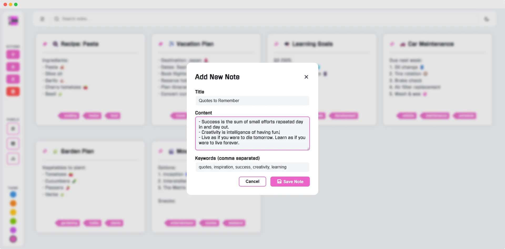
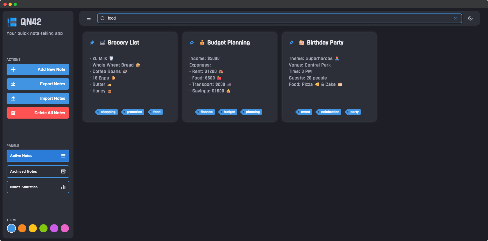
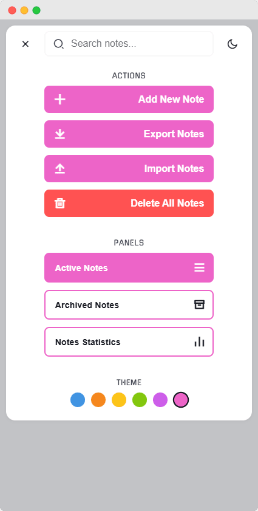
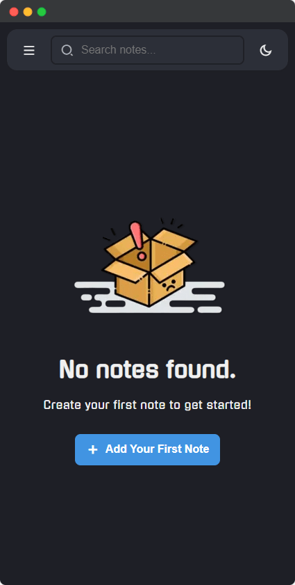
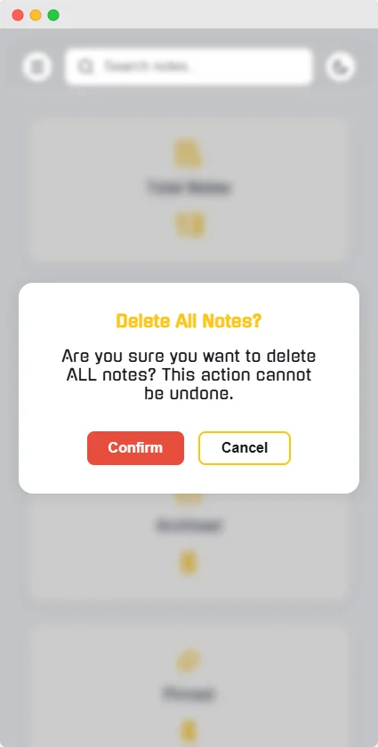
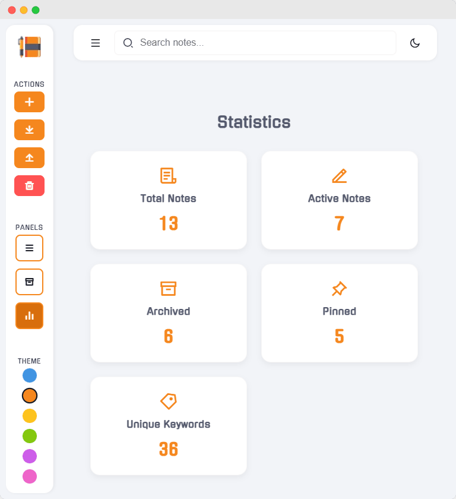
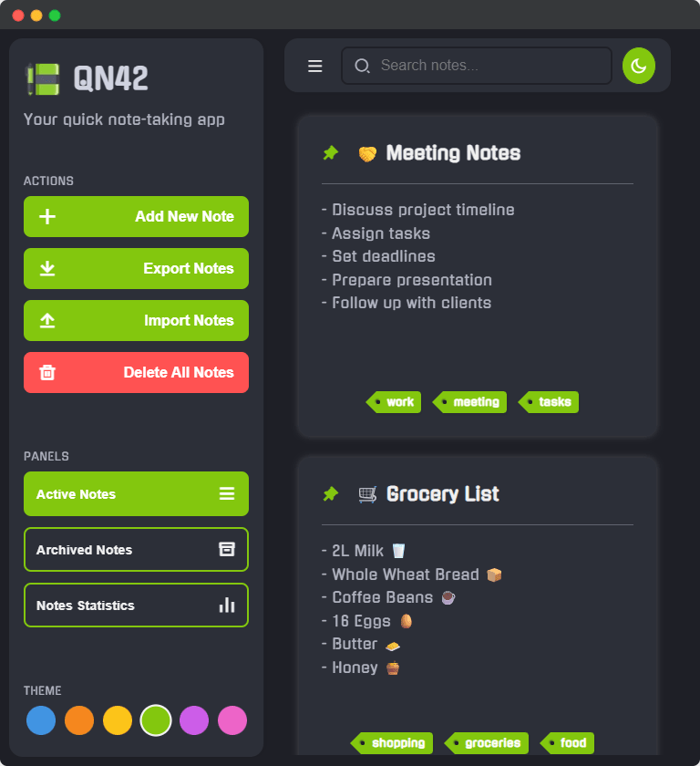
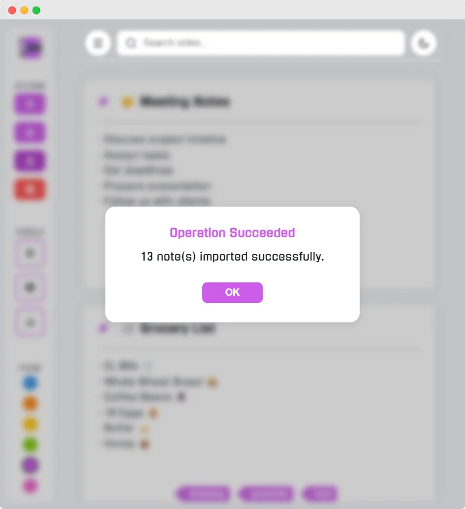

<h1 align="center">
    
     QN42 - QuickNotes
</h1>

   &nbsp;&nbsp;
   &nbsp;&nbsp;
   &nbsp;&nbsp;
   &nbsp;&nbsp;
   &nbsp;&nbsp;
   &nbsp;&nbsp;
  

---

## 📑 Table of Contents
- [📑 Table of Contents](#-table-of-contents)
- [📝 Overview](#-overview)
- [📸 Preview](#-preview)
  - [🖥️ Desktop View](#️-desktop-view)
  - [📱 Mobile View](#-mobile-view)
  - [📱 Tablet View](#-tablet-view)
- [✨ Features](#-features)
- [🚀 Usage](#-usage)
- [🌐 Demonstration](#-demonstration)
- [🤝 Contributing](#-contributing)
  - [🚀 How to Contribute:](#-how-to-contribute)
  - [🐛 Found a Bug?](#-found-a-bug)
- [📄 License](#-license)
- [👨‍💻 Author](#-author)
- [🙏 Thank You](#-thank-you)

---

## 📝 Overview 

**`QuickNotes42`** is a lightweight, web-based note-taking app designed for fast and easy note management.  
With a clean and intuitive interface, it lets you create, edit, and delete notes effortlessly, all within your browser, no installation needed.

---

## 📸 Preview

### 🖥️ Desktop View  

 
 
  

### 📱 Mobile View  
&nbsp;
&nbsp;

### 📱 Tablet View  
&nbsp;
&nbsp;

---

## ✨ Features

- **`📝 Create, Edit & Delete Notes`**: Manage your notes easily with a straightforward interface.
- **`🔍 Real-Time Search`**: Quickly find notes using the built-in search bar with instant filtering as you type.
- **`📌 Pin & Archive Notes`**: Organize your notes by pinning important ones or archiving completed tasks.
- **`🎨 Color Themes`**: Choose from multiple beautiful color themes (Blue, Green, Orange, Pink, Purple, Yellow) to personalize your experience.
- **`🌙 Dark/Light Mode`**: Toggle between light and dark themes for comfortable viewing day or night.
- **`📱 💻Fully Responsive Design`**: Works beautifully on desktops, tablets, and smartphones with adaptive mobile navigation.
- **`Mobile-First Navigation`**: On mobile devices, access all features through an expandable header menu with smooth animations.
- **`📊 Statistics Dashboard`**: View helpful statistics about your notes including total count, pinned notes, and archived notes.
- **`Local Storage Persistence`**: Notes are saved in your browser’s local storage to keep your data intact across sessions.
- **`Keyboard Shortcuts`**: Speed up your workflow with handy keyboard commands. **(Coming soon)**
- **`Accessibility-Focused`**: Supports screen readers and keyboard navigation for an inclusive experience. **(Under development)**
- **`🌐 Cross-Browser Compatible`**: Fully functional on Chrome, Firefox, Safari, Edge, and more.
- **`📤 Export & Import Notes`**: Backup or transfer your notes with timestamped JSON exports and easy file imports.
- **`🚀 No Installation Required`**: Access your notes instantly via any modern web browser.

---

## 🚀 Usage

1. 📝 Click the **`Add Note`** button to create a new note.  
2. ✏️ Edit or delete notes using the buttons on each note card.  
3. 🔍 Use the search bar to filter notes by keywords in real-time.  
4. 📌 Pin important notes or archive completed ones using the pin and archive buttons.  
5. 🌙 Switch between light and dark themes with the toggle in the sidebar/header.  
6. 🎨 Choose from multiple color themes to personalize your experience.  
7. 📊 View note statistics in the sidebar to track your productivity.  
8. 📤 Export your notes to a timestamped JSON file for backup or import notes from a file to restore or transfer them.  
9. 📱 On mobile devices, tap the menu button to access all features in the expandable header navigation.  

> **Important:** Notes are saved locally in your browser's storage. They will persist across sessions on the same device and browser but will not sync across different devices or browsers. Clearing your browser data will delete your notes.

---

## 🌐 Demonstration

This is the live demo of [QuickNotes42](https://ababdelo.github.io/QN42/)

---

## 🤝 Contributing

Contributions to **`QuickNotes42`** are very welcome! 🎉  
If you'd like to help improve the project, please fork the repository and submit a pull request. Feel free to open issues for bugs or feature requests.

### 🚀 How to Contribute:
- 🍴 Fork the repository
- ⭐ Create a feature branch
- 💻 Make your changes
- ✅ Test your changes
- 📤 Submit a pull request

### 🐛 Found a Bug?
- 🔍 Check if it's already reported in issues
- 📝 Create a detailed bug report
- 🏷️ Use appropriate labels

---

## 📄 License

This project is licensed under a **Personal Use License**, see the [LICENSE](license.md) file for details.

**Summary:** This software is free for personal, educational, and non-commercial use only. Commercial use is prohibited without explicit permission.

---

## 👨‍💻 Author

Developed by [ababdelo](https://edunwant42.tech)

---

## 🙏 Thank You

**Thank you for checking out QuickNotes42!**  
**Happy note-taking!** 🚀✨
